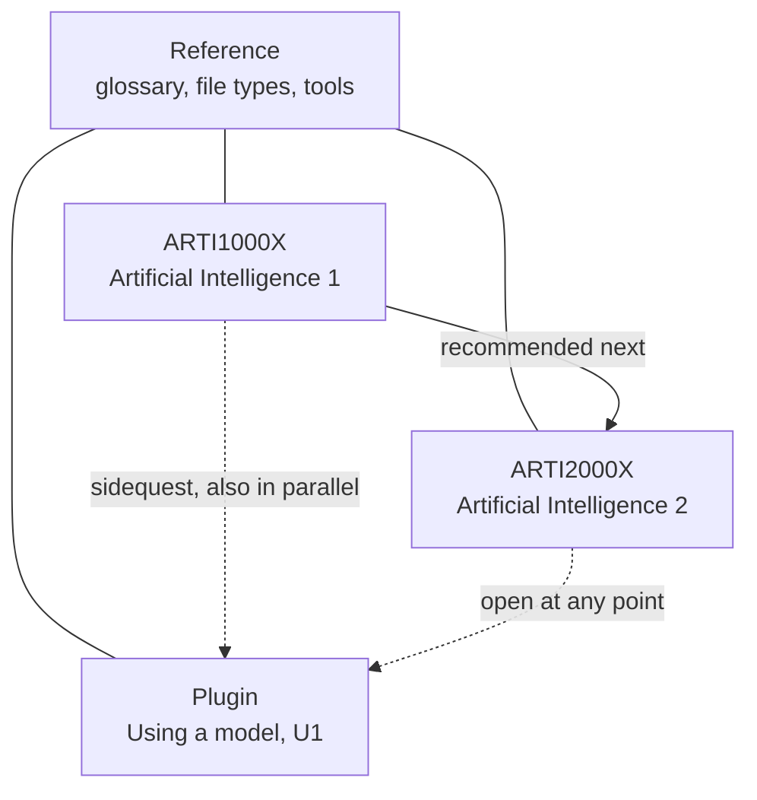

# Courses

ARTI1000X and ARTI2000X are the two main courses. They follow the subject syllabus in `level1.md` and `level2.md`. The pages under Active were written from immediate use: how a few people spend a model's time. Reference is shared by every course and by every plugin. Segment kinds, summaries, examinations, and picture and clip placeholders are in `curriculum/assignments.md`.

## Roles

| Role | What it is | How a reader meets it |
| --- | --- | --- |
| ARTI1000X | The first main course. Definition, data, uses, techniques, methods, simpler problem-solving, and the human, legal, and societal comparisons. | Stands on its own. |
| ARTI2000X | The second main course. One field in more depth, stronger methods, training and networks, and a fuller judgment of use. | Recommended after ARTI1000X. Open before that course is finished. Each page, when written, restates what it assumes. |
| Plugin | A stand-alone segment for a more specialized use than the mainstream courses. U1, using a model, is the first. Later plugins wait until another use-case is real. | Optional. A fitting point is after L1.C.4, or after ARTI1000X. Also usable beside any point in either course, including in parallel. |
| Reference | Glossary, file types (`R.1`), and Tools and models (`#/tools`, X.1, X.2, X.3). | Valid during ARTI1000X, ARTI2000X, and any plugin. The header already keeps these links on every page. |

Overlap is intentional. A main-course page teaches the mainstream sense of a shared idea in a few sentences, so the course can be read alone. The plugin keeps the operational habits: effort, threads, clocks, pacing, session handoff, compression or compaction, and skills. A main-course page that starts teaching those habits has two jobs and gets split.

`requires` on ARTI2000X stays a label. The outline already says those items can be opened before ARTI1000X is finished. Plugins are not required to finish either course. Neither course is required to open a plugin.

The live outline still leads with Active, then Reference, then the two courses. That order can be revised when the first new ARTI1000X pages are published. The intended order is ARTI1000X, ARTI2000X, then plugins, with Reference remaining in the header and listed once. This plan does not move the outline.

## Where authoring starts

Start at the beginning of ARTI1000X and write forward from `L1.C.1`.

`L1.C.1` is the only subject page with a body. The syllabus order is the order a self-contained course can be read in. The middle of the concept block, `L1.C.4`, is where generative AI appears, so that page is the first sidequest door into the plugin. It is a pointer, written when the page is written, and it is not the place authoring starts. The end of ARTI1000X is law, ethics, and society. Those pages use the earlier concepts, so authoring does not start there and walk backward.

Tools-page continuation stays paused until it comes up in its own pass. The open choice about further models stays on the tools landing.

Child rows stay in this file until a session is writing that child. Adding them to `level1.md` would list them on the outline. Lesson HTML stays hand-written. See `curriculum/structure.md`.

The dogfood entry for data selection, for one decision tree, and for the problem-solving steps is `R.2`, with the working card in `curriculum/method.md`. Subject writing still resumes at `L1.C.1`. `R.2` holds only the procedure that is already easy to say. `L1.C.2`, `L1.C.6`, and `L1.X.1` stay the mainstream pages and link to `R.2` when they are written.

## Where the pages we already have sit

| Pages | Role | What the main courses keep from them |
| --- | --- | --- |
| U1.0, U1.9 | Plugin frame | A later touch of the welcome can name the plugin as optional beside ARTI1000X. The close already offers the subject, a job of one's own, or a pause. |
| U1.E.1 | Plugin | One mainstream sentence: a setting is not a different model. The effort scale stays in the plugin. |
| U1.B.1 | Plugin | One mainstream sentence: a generative system reads a prompt and writes a reply. Token accounting for a thread stays in the plugin. |
| U1.B.2, U1.B.3 | Plugin | Clocks and pacing stay in the plugin. |
| U1.S.1, U1.S.2 | Plugin | A problem-solving page may point here when the learner is leaving a coding session or a web thread. |
| U1.S.3 | Plugin | Compression is a product habit. `L2.D.5` is a subject point about explaining a result from the data. They link across. They stay different pages. |
| U1.K.1, U1.K.2 | Plugin | Packing a skill stays in the plugin. File types stay in Reference. |
| `R.1`, `R.2`, `R.3`, glossary, X.1–X.3 | Reference | Used from either course and from the plugin. `R.2` is the methods stub. `R.3` collects the HTML, JavaScript, and Python orientations. |
| L1.C.1 | Start of ARTI1000X | The next page to deepen, then leave as one segment. |

The earlier holes U0.1, U0.2, and U0.3 fold into this map. The mainstream sentences live on `L1.C.4.4`. The operational versions stay on U1.E.1 and U1.B.1. A separate opening course is not added for them.

## ARTI1000X concept block

`L1.C.1` and `L1.C.3` stay one page each. The others earn substeps because one page would hold two or more jobs. A parent that has substeps keeps its syllabus id as the group. `.9` on that parent is the summary of the substeps. The letter close `L1.C.9` summarizes the whole concept block. Examinations are planned in `assignments.md` and are not built in this pass.

| Id | Pages | Kind of page | Why this grain |
| --- | --- | --- | --- |
| L1.C.1 | One page. Already drafted. | Reading | The definition and the labels for later pages: human intelligence, data, application, technique, algorithm, machine learning. A diagram can show those labels around the definition. |
| L1.C.2 | L1.C.2.1 data, L1.C.2.2 quality, L1.C.2.3 selection, L1.C.2.9 summary | Reading, then a summary | Exact outcome, three jobs. Quality and selection each get a short exercise. The three piles on `R.2` are the early selection example from building this course. |
| L1.C.3 | One page | Reading | Driving forces as one argument. A diagram can show the forces. Split only if a draft turns into two arguments. |
| L1.C.4 | L1.C.4.1 prediction, L1.C.4.2 robotics, L1.C.4.3 computer vision, L1.C.4.4 generative AI, L1.C.4.9 summary | Reading | At-least list of four uses. `L1.C.4.4` says what generative AI refers to here: a system that produces text, an image, or something similar from a prompt. It names the plugin for effort, threads, clocks, handoff, compression, and skills. |
| L1.C.5 | L1.C.5.1 search, L1.C.5.2 classification, L1.C.5.3 object recognition, L1.C.5.9 summary | Reading | At-least list of three techniques. Object recognition stays a technique. Computer vision stays a use, on L1.C.4.3. |
| L1.C.6 | L1.C.6.1 decision trees, L1.C.6.2 regression, L1.C.6.3 supervised learning, L1.C.6.4 unsupervised learning, L1.C.6.9 summary | Reading | At-least list of four methods. Supervised and unsupervised share one side-by-side diagram. The first decision tree, the page-or-table choice, is the worked example on `R.2`. |
| L1.C.9 | One page, later | Summary of L1.C.1 through L1.C.6 | No new ideas. |
| L1.C.Q | One page, later | Examination of the concept block | About 16 questions. Relations across parents, such as how selection changes a prediction, and how a use differs from a technique. |

`L1.C.4` and `L1.C.6` are large enough for their own examinations once the substeps exist: about 10 questions each. `L1.C.2` and `L1.C.5` stop at the summary. The letter examination is the one that gets written first.

Pictures and the one clip stub for this block are listed in `assignments.md`.

## The rest of ARTI1000X

Same close pattern: `.9` summarizes the letter, `.Q` is the examination. Substeps below are the planned grain. They are not outline rows yet.

| Parent | Planned grain | Practical kind | Close |
| --- | --- | --- | --- |
| L1.X.1 | One reading page for the process. A workshop later if the process is taught as ordered steps. The five steps this course is already using are on `R.2`. | Reading, then workshop | Covered by L1.X.9 |
| L1.X.2 | One small lab for each listed example: classification, object recognition, prediction, natural language processing, basic machine learning, game agents. Bind is at-least, so each listed example is covered, and each lab stands alone. | Lab | L1.X.2.9 summary |
| L1.X.3 | One reading page on principles, plus one lab that applies machine learning or robotics. | Reading and lab | Covered by L1.X.9 |
| L1.X.4 | A workshop: prepare data, train, check. The steps follow one another. | Workshop | Covered by L1.X.9 |
| L1.X.9 | Summary of the exercise block. | Summary | |
| L1.X.Q | Examination, about 12 questions. | Examination | Written after the X pages exist. |
| L1.D.1 through L1.D.5 | One discuss page each. A discuss page asks for a short written response. It is not a lab. | Discuss | L1.D.9 summarizes the five. |
| L1.D.Q | Examination, about 12 questions, on comparison, law, ethics, and society. | Examination | Written after the D pages exist. |

A course welcome `L1.0` and a course close `L1.9` wait until `L1.C.2` is in progress. `L1.C.1` is the start until then. `L1.9` can offer ARTI2000X, the using-models plugin, or a pause. That close is the course-level stand-in for a larger task. A whole-course examination waits until both the concept block and the exercise block exist.

## ARTI2000X

Write these pages after ARTI1000X has passed `L1.C.4`. The same summary and examination pattern applies to L2.C, L2.X, and L2.D when that course is being written. Substep lists for L2 wait until then.

Each page restates the assumption below, in a few lines, so the page can be read before ARTI1000X is finished. The recommended order remains ARTI1000X, then ARTI2000X. `L2.C.1` and `L2.D.3` use the same chosen field, from the examples social media, healthcare, and transportation.

| Id | Assumes at least | Plugin overlap, if any |
| --- | --- | --- |
| L2.C.1 | The four uses from L1.C.4 can be named. | The field page may point at the plugin when the field work is done in a chat. |
| L2.C.2 | Search, classification, object recognition, and the four L1.C.6 methods can be named. | |
| L2.C.3 | The L1.C.4 uses have been met as an overview. | |
| L2.X.1 | A problem-solving process has been met, or this page sketches one. | Quality assurance may point at a seed or a skill as optional practice. |
| L2.X.2 | The matching L1.X.2 example has been met, or this page names the example it extends. | |
| L2.X.3 | One of machine learning, game agents, prediction, or robotics has been met, or this page picks one and teaches it here. | |
| L2.X.4 | Search, classification, and machine learning have been met as names, or this page supplies the names before the strengths and weaknesses. | |
| L2.X.5 | No earlier row. This page teaches the building blocks of a neural network from the start. | |
| L2.X.6 | A basic idea of training has been met, or this page explains labeled data, unlabeled data, training data, and test data on its own. | |
| L2.X.7 | L2.X.5 is the recommended previous page. This page still says what a deep network is made of before configuration. | |
| L2.D.1 | A simple human-and-AI comparison has been met, or this page sets the problem up again. | |
| L2.D.2 | A law or regulation has been named, or this page names the one it discusses. | |
| L2.D.3 | The field chosen on L2.C.1. Democratic, ethical, social, economic, environmental, and security aspects can be taught on this page if L1.D.5 is unread. | |
| L2.D.4 | No earlier row. Situations and the risk judgment are on this page. | |
| L2.D.5 | Data quality and selection, and the idea of transparency. This page teaches both if the reader comes straight here. | A link to U1.S.3 when the reader wants the product habit of compression. The weakness on this page is about explaining a result from the dataset. |

## Later plugins

Another plugin is a new section with its own welcome and close, for a specialized use the two main courses only touch. The using-models section shows the shape: a run of reading pages, a real-case close, and pointers back to Reference. The dated comparison of skill-file standards, the desktop folder-prompt page, and the skill-bundle workshop stay on the U1 list in `plan.md`. They are plugin material when they are built.
